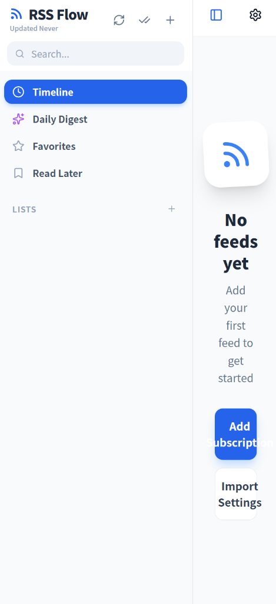
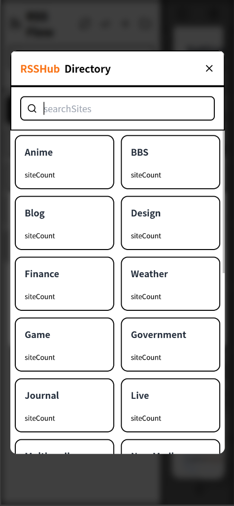

<div align="center">
  
</div>

# RSS Flow

RSS Flow is a modern, clean, and feature-rich RSS reader built with React, Vite, and Capacitor. It focuses on a distraction-free reading experience, with special optimization for E-ink devices and AI-powered summarization.

## Screenshots

<div align="center">
  
  
</div>

## Features

*   **Clean & Modern UI:** A minimalist interface designed for reading.
*   **E-ink Mode:** High-contrast, paginated reading experience perfect for E-ink tablets or just focused reading.
*   **AI Summaries:** Integrated with OpenAI Compatible APIs (e.g., Google Gemini, OpenAI) to generate concise summaries of articles and daily digests.
*   **Cross-Platform:** Runs on the web and compiles to Android (and iOS) apps using Capacitor.
*   **Offline Support:** Caches articles for offline reading.
*   **OPML Support:** Import and export your feed subscriptions easily.
*   **Customization:**
    *   Multiple themes (Light, Dark, Paper).
    *   Adjustable font sizes, line heights, and margins.
    *   Custom fonts.
*   **Internationalization:** Full support for English and Simplified Chinese.

## Tech Stack

*   **Frontend:** React, TypeScript, Vite
*   **Styling:** Tailwind CSS
*   **Mobile:** Capacitor (Android/iOS)
*   **State Management:** React Context
*   **Storage:** LocalStorage & Capacitor Filesystem
*   **AI:** OpenAI Compatible API (fetch)
*   **Icons:** Lucide React

## Getting Started

### Prerequisites

*   Node.js (v18 or higher)
*   npm or yarn

### Installation

1.  Clone the repository:
    ```bash
    git clone https://github.com/GaryOAO/RSS-Flow.git
    cd RSS-Flow
    ```

2.  Install dependencies:
    ```bash
    npm install
    ```

3.  Start the development server:
    ```bash
    npm run dev
    ```

### Building for Android

1.  Sync Capacitor:
    ```bash
    npx cap sync android
    ```

2.  Open in Android Studio:
    ```bash
    npx cap open android
    ```

3.  Or build APK directly:
    ```bash
    cd android
    ./gradlew assembleDebug
    ```

## Configuration

### AI Features
To use the AI summarization features, you need to provide an **OpenAI Compatible API Key** and Base URL in the settings menu within the app. This supports various providers like Google Gemini, OpenAI, DeepSeek, etc.

## License

MIT
